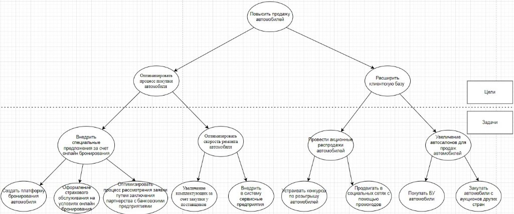

# 2 **Построение дерева целей и задач, морфологическая карта**
  2.1 ## **Дерево целей и задач**
Дерево целей и задач представлено на рисунке 2.1.

**Рисунок 2.1 – Дерево целей и задач**

В данном дереве целей стратегической целью является «Повысить продажи автомобилей». Эта цель имеет две тактический подцели:

«Оптимизировать процесс покупки автомобиля» и «Расширить клиентскую базу».

Для того, чтобы оптимизировать процесс покупки автомобиля, мы ставим два основные задачи: «Внедрить специальные предложения за счёт онлайн бронирования» и «Оптимизировать скорость ремонта автомобиля».

Для выполнения задачи по внедрению специальных предложений за счёт онлайн бронирования, мы ставим подзадачу «Создать платформу бронирования автомобиля», которая поможет нам быстрее подписывать все договоры и заявления, тем самым экономя время. Также мы ставим подзадачу

«Оформление страхового обслуживания на условиях онлайн бронирования», пользуясь которой, пользователям не нужно будет тратить лишнее время и деньги на поиск страховых агентов в сети. Также мы ставим подзадачу

«Оптимизировать процесс рассмотрения заявки путем заключения партнерства с банковскими предприятиями», что ускорит принятие решение о выдачи кредита за самое кратчайшее время.

Оптимизировать скорость   ремонта   мы   можем   за   счет   подзадач

«Увеличением комплектующих за счёт закупки у поставщиков», и «Внедрить в систему сервисные предприятия». Все эти подзадачи направлены на ускорение работы ремонта и предоставление автомобиля.

Для выполнения цели «Расширения клиентской базы», мы ставим две основные задачи. Первая – «Провести акционные распродажи автомобилей». Логично, что при проведениях акции, появиться новые клиенты, за счёт среднего и низкого сегмента рынка. Вторая – «Увеличение автосалонов для продаж автомобилей». За счёт этого будет большой охват территорий, где люди смогут купить автомобиль.

Первую задачу мы разбиваем на две подзадачи: «Устраивать конкурсы по розыгрышу автомобилей» и «Продвигать в социальных сетях с помощью промокодов».

Для выполнения второй задачи, нам потребуется «Покупать БУ автомобили» и «Закупать автомобили с аукционов других стран»
2.2 ## **Морфологическая карта**
В таблице 2.2 приведена морфологическая карта проблемы оптимизации покупки автомобиля, которая составлена по вышеописанному дереву целей и задач.

*Таблица 2.2 – Проблема оптимизации покупки автомобиля*

|

Объект воздействия
|

Методы воздействия
|
| :- | :- |
||Ограничение|Оптимизация|Внедрение (контроль)|
|Покупка|
Ограниченное количество специальных предложений по

покупки автомобиля
|

Внедрить специальные

предложения за счет онлайн бронирования
|Программные модули в помощь оформления покупки|
|Сервис|Ограничение по скорости ремонта автомобиля|Увеличение комплектующих за счет закупки у поставщиков|
Внедрить в систему отзывы и

предложения предприятий
|
|Заявка|
Ограничить процесс рассмотрения заявки путем

заключения партнёрства с банковскими

предприятиями
||Реализовать онлайн проверку данных|
Для повышения скорости продажи, в первую очередь нам необходимо

«Программные модули в помощь оформления покупки», для большего трафика автосалона. Затем мы должны «Внедрить в систему отзывы и предложения предприятий», для повышения скорости ремонта автомобиля и качества оказанных услуг.

Для того, чтобы повысить скорость рассмотрения заявок и подписания договоров, мы можем «Ограничить процесс рассмотрения заявки путем заключения партнёрства с банковскими предприятиями».
