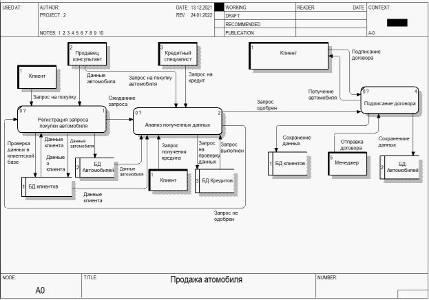

# **Моделирование в общеизвестных нотациях (IDEF0 и DFD) состояний системы «as is» и «to be»**
   1. ## **Моделирование состояния системы «as is»**
На рисунке 3.1 представлена модель системы в состоянии «as is» в нотации IDEF-0.

**Рисунок 3.1 – Декомпозиция контекстной диаграммы IDEF0**

В систему поступают данные о регистрации запроса на покупку автомобиля. Это происходит, если клиент подал заявку на покупку автомобиля. Данные о покупке попадают в блок «Анализ полученных данных», где обрабатываются, и в итоге формируются в активную заявку о покупке. В данном процессе участвуют и клиент, который вносит описание автомобиля, и продавец консультант, который обрабатывает эти данные и создает заявку о покупке. Процесс регулируют правила обработки информации, правила рассмотрения запроса, и форма составления заявок.

Последний блок «Подписание договора», активируется тогда, когда клиент сделал запрос на покупку и получил положительный результат на

приобретения автомобиля, где его проверяли по различным БД, чтобы удостовериться в данных пользователя. В этом блоке происходит заключение договора выдачи, в котором клиент и организация подписывают все соглашения. Итогом работы системы является заключенный договор выдачи. На рисунке 3.2 представлена декомпозиция подпроцесса «Анализ полученных данных».

**Рисунок 3.2 – Декомпозиция подпроцесса «Анализ полученных данных»**

В анализ полученных данных входят три функциональных блока:

- Рассмотрения запроса
- Запрос на покупку
- Внесение данных в базу

Запрос от клиента поступает в блок «Рассмотрения запроса», где сотрудник, подбирает с клиентом автомобиль, обрабатывает и сохраняет данные о самом клиенте.

Затем сотрудник производит запрос на покупку в блоке «Запрос на покупку». Здесь проверяется полнота внесенных данных об клиенте, а также

проходит одобрение покупки, или выдачи кредита.

Затем, если данные запросы корректны, и запрос одобрен, работает блок

«Внесение данных в бд». Здесь сотрудник заполняет форму заявки, внося данные в БД, полученные от клиента. Результатом работы процесса является одобрение запроса.

На рисунке 3.3 представлена декомпозиция подпроцесса «Подписание договора».

**Рисунок 3.3 – Декомпозиция подпроцесса «Подписание договора»**

В подписание договора входят четыре функциональных блока:

- Проверка личности клиента
- Проверка автомобиля
- Установка оборудования
- Составление договора

Данный подпроцесс задействуется в том случае, если клиент захотел купить автомобиль.

А	блоке	«Проверки	личности	клиента»	сотрудник	организации проходится по всем необходимым параметрам, проверяя личность клиента.

Если личность клиента подтвердилась, в дело вступает «Проверка автомобиля». В нем учувствует, собственно, договор и информация о покупке автомобиля.

После проверки автомобиля идет блок «Установка оборудования», он вступает если клиент захотел установить дополнительное оборудование за отдельную плату.

После того, как установка завершена, согласно условиям выдачи, клиент подписывает договор купли продажи, как со стороны клиента, так и со стороны организации.

Результатом работы блока являются данные о заключении договора.

1. ## **Модель DFD в состоянии «as is»**
На рисунке 3.4 представлена модель системы в состоянии «as is» в нотации DFD.

**Рисунок 3.4 - Декомпозиция контекстной диаграммы DFD**

Все процессы в диаграмме DFD такие же по свойства и функционалу, как и в IDEF-0. Но в данной диаграмме добавляются внешние сущности и

хранилища данных.

Сначала клиент отправляет запрос на покупку автомобиля. Запрос регистрируется	в	системе,	в	блоках	«Регистрация	запроса	покупке автомобиля» и «Анализ полученных данных». Отсюда данные запроса поступают сотруднику, который их обрабатывает. Данные о заявке поступают в БД заявок, а данные о самом автомобиле поступают в БД автомобиля. Активная заявка о покупке из БД заявок поступает в блок «Анализ полученных данных». После этого сотрудник и клиент идут осматривать

автомобиль, где после проверок направляются на подписание договора.

Затем клиент и сотрудник от организации, заключают договор в блоке

«Подписание договора». После заключения договора, данные об успешном его заключении сохраняются в БД договоров, и дублируются клиенту.

На рисунке 3.5 представлена декомпозиция подпроцесса	«Анализ полученных данных».

**Рисунок 3.5 – Декомпозиция подпроцесса «Анализ полученных данных»**

Декомпозиция	подпроцесса	начинается	с	поступления	в	систему активных заявок о покупке от клиента. Данные поступают в процесс

«Рассмотрения запроса», который выполняет сотрудник автосалона, и данные результата которого, передаются на «Запрос на покупку».

Затем, получив данные результата анализа, сотрудник производит запрос на получение кредита или бронирования автомобиля, получая данные, и сохраняя их также в «БД автомобиля».

После одобрения сотрудник производит «Внесение данных в БД», в которой также сохраняются все данные.
1. ## **Моделирование состояния системы «to be»**
Вышеописанные модели IDEF-0 и DFD содержат ряд недостатков. Допустим из «Анализа полученных данных» у нас стрелка идет сразу в

«Подписание договора». При этом, после анализа предмета, он никоим образом нигде не сортируется. Также не понятно каким образом конечный клиент узнает о том, что автомобиль в надлежавшем состоянии. В данном случае – только при обращении, но было бы куда удобнее, если бы организация показывала автомобиль до подписания договора купли продажи. Измененные модели IDEF-0 и DFD представленные на рисунках 3.1 – 3.5.

1. ## **Модель IDEF-0 в состоянии «to be»**
На рисунке 3.6 представлена модель системы состояния «to be» в нотации IDEF-0.

**Рисунок 3.6 – Декомпозиция контекстной диаграммы IDEF-0**

В сравнении с моделью as is, данная модель to be претерпела ряд изменений.

Был добавлен такой блок, как «Обеспечение автомобиля». После анализа данных, происходит обеспечение автомобиля, где клиент может осмотреть автомобиль до его покупки и попросить установить доп оборудование.

1. ## **Модель DFD в состоянии «to be»**
На рисунке 3.7 представлена модель системы в состоянии «to be» в нотации DFD.

**Рисунок 3.7 Декомпозиция контекстной диаграммы DFD**

Тот же блок, также появился и на диаграмме DFD. Но тут в дело вступают внешние сущности «Продавец консультант», «Сервисный специалист» и «БД автомобилей». Теперь данные анализа поступают сотруднику, по которым сотрудник может показать автомобиль.
